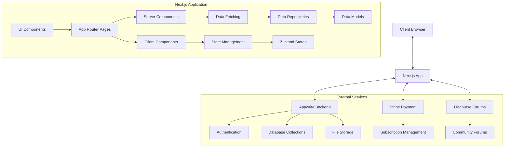
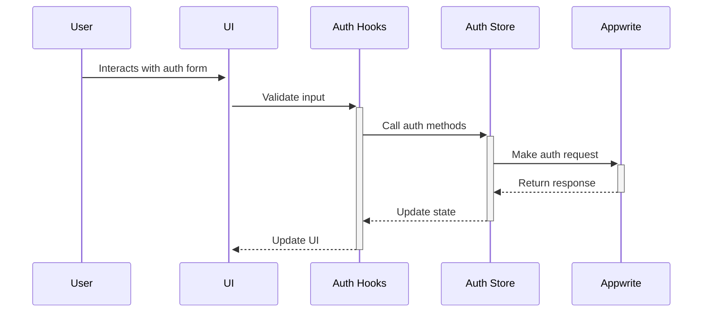
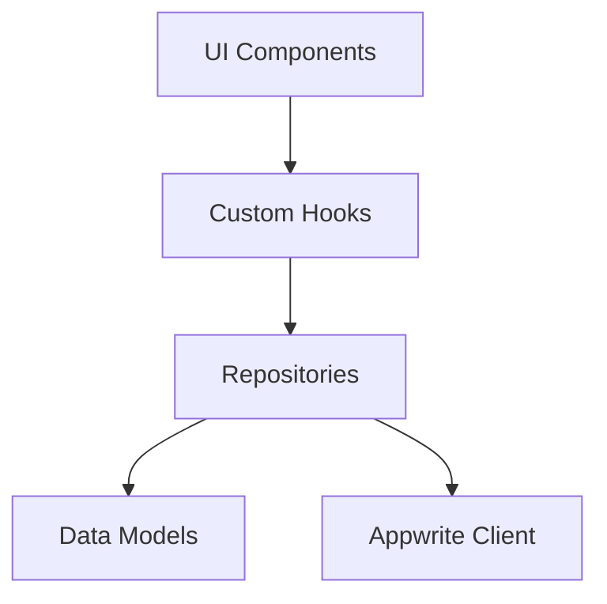
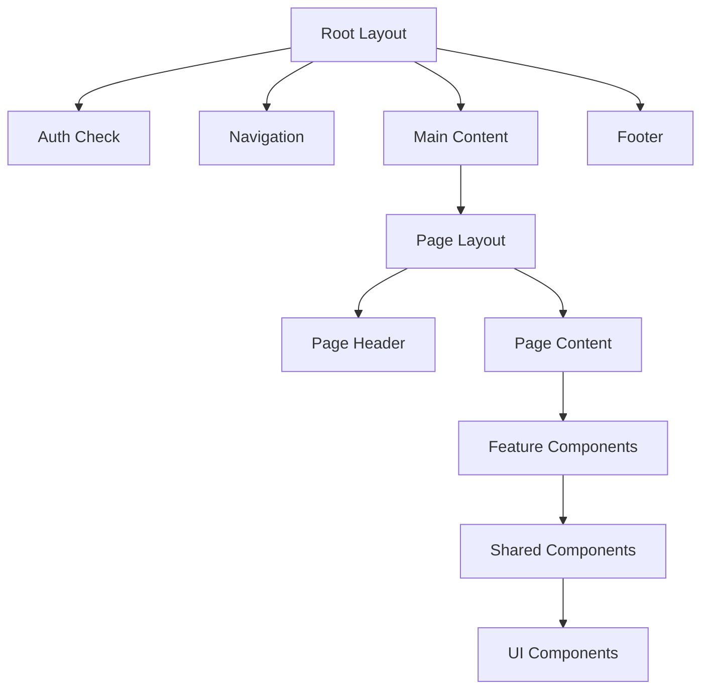
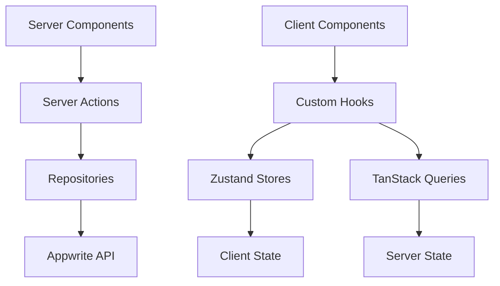
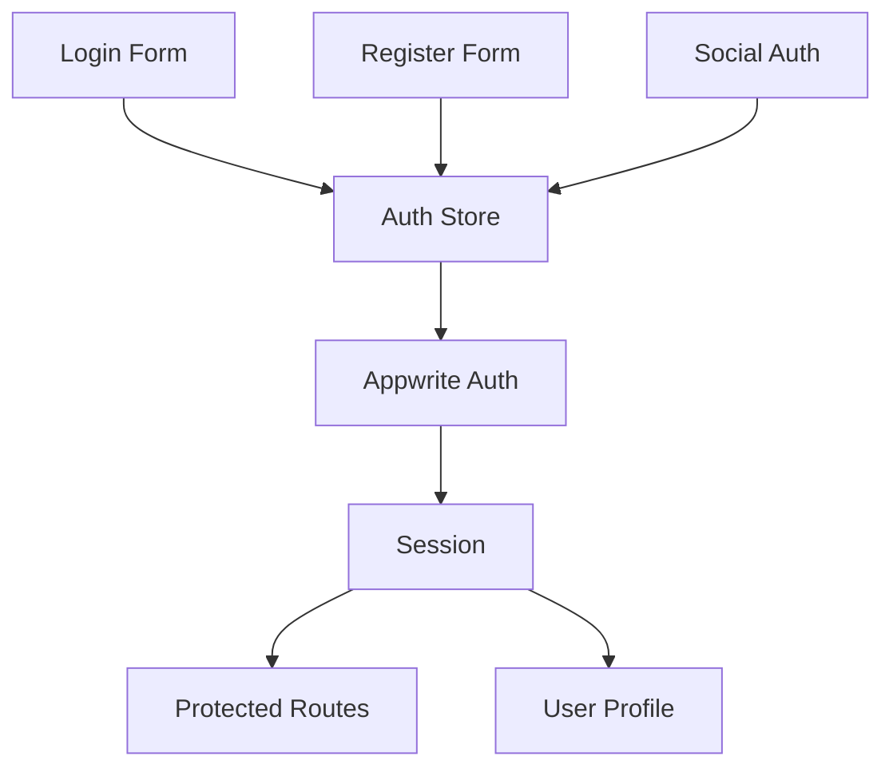

# System Patterns

## System Architecture

WYOS is built using a modern web application architecture with Next.js 15 and the App Router at its core. The system follows a clear separation of concerns with distinct layers for presentation, business logic, and data access.

### High-Level Architecture

### Route Structure

The application uses Next.js App Router with a well-organized route structure:

- `(auth)/` - Authentication-related routes (protected)
- `(core)/` - Main app features (protected)
- `(marketing)/` - Public pages (home, about, membership)
- `(subscription)/` - Subscription-related pages
- `api/` - Custom API routes
- `auth/` - OAuth callback routes

This structure clearly separates public and protected routes while grouping related functionality.

## Key Technical Decisions

### 1. Server-First Approach

WYOS prioritizes server components where possible to:

- Reduce client-side JavaScript
- Improve performance and SEO
- Enhance security by keeping sensitive operations server-side

The application uses the "use client" directive only when necessary, such as for:

- Event listeners
- Browser APIs
- State management
- Client-side-only libraries

### 2. Authentication System

The authentication system uses Appwrite as the backend provider with a Zustand store for state management. Key components include:

- **Auth Store**: Central state management for authentication
- **Auth Layout**: Handles session verification and redirects
- **Auth Forms**: UI components for authentication flows
- **Auth Hooks**: Custom hooks for form handling and validation

The authentication flow follows this pattern:

### 3. Data Management Strategy

WYOS implements a clear data management strategy:

- **Server State**: Managed by TanStack Query for data fetching, caching, and synchronization
- **Client State**: Managed by Zustand with Immer for immutable updates and Persist for persistence
- **Form State**: Managed by React Hook Form with Zod for validation

This separation ensures that each type of state is handled by the most appropriate tool.

### 4. External Integrations

The application integrates with several external services:

- **Appwrite**: Backend services including authentication, database collections, and storage
- **Stripe**: Subscription management and payment processing
- **Discourse**: Community forums with SSO integration

These integrations are abstracted through service layers to maintain separation of concerns.

## Design Patterns

### 1. Repository Pattern

WYOS uses the repository pattern to abstract data access logic:

Repositories are organized by domain (e.g., knowledge, resources) and provide a clean interface for data operations.

### 2. Custom Hooks Pattern

Custom hooks encapsulate and reuse stateful logic across components:

- **Data Hooks**: For fetching and managing data (e.g., `useKnowledgeRevalidation`)
- **UI Hooks**: For managing UI state and interactions
- **Auth Hooks**: For authentication-related operations

This pattern promotes code reuse and separation of concerns.

### 3. Component Composition

WYOS follows a component composition pattern with a clear hierarchy:

- **Page Components**: Top-level components that represent routes
- **Feature Components**: Domain-specific components (e.g., knowledge, resources)
- **Shared Components**: Reusable components used across features
- **UI Components**: Low-level, presentational components

This approach promotes reusability and maintainability.

### 4. State Management with Zustand

The application uses Zustand for state management with these patterns:

- **Store Slices**: Separate stores for different domains (Auth, Knowledge, Resources)
- **Immer Integration**: For immutable state updates
- **Persist Middleware**: For persisting state across sessions
- **TypeScript Integration**: For type-safe state and actions

### 5. Server Actions Pattern

For server-side operations, WYOS uses Next.js server actions to:

- Handle form submissions
- Process data mutations
- Perform server-side validations
- Revalidate cached data

## Component Relationships

### UI Component Hierarchy

### Data Flow

### Authentication Flow

## Coding Standards and Patterns

WYOS follows strict coding standards and patterns:

- **TypeScript**: Strong typing for all components, functions, and data structures
- **SOLID Principles**: Emphasis on single responsibility and dependency inversion
- **Functional Programming**: Preference for pure functions and immutability
- **Early Returns**: Using early returns for conditional logic
- **Error Handling**: Comprehensive error handling at all levels

These patterns ensure code quality, maintainability, and scalability as the application grows.
